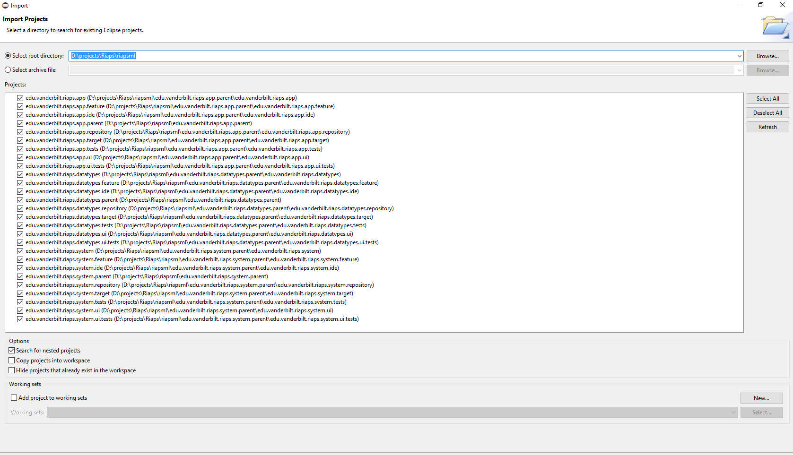

[](https://travis-ci.com/RIAPS/riaps-dsml)
# riaps-dsml
RIAPS Modeling Language

# Setup system before development
    '''
    $ export JAVA_HOME=/usr/lib/jvm/java-1.8.0-openjdk-amd64
    $ apt-get install maven
    
- Eclipse Plugins to install
    - Using Help --> Install New Software ...
    	- m2e – Extensions Development Support
    - Using Help --> Eclipse Marketplace ...
    	- Eclipse Xtext 2.11.0
	- Eclipse Xtend 2.11.0 
	
# To start with the development
- Clone the git repository
- Run the mvn build once inside edu.vanderbilt.riaps.system.parent project directory. This step is necessary to create the src-gen and xtend-gen folders. These folders are not tracked in the git repository because they are generated. 

    ```
    $ pushd edu.vanderbilt.riaps.system.parent && mvn clean install && popd
    ```

- Then import the workspace into eclipse. **Ensure that you select the option for searching for nested projects.**


- Once you have imported the project into workspace, start compiling the projects in the following sequence 
    1. edu.vanderbilt.riaps.datatypes
    	To compile the project. 
	- Expand the project selection to 
	edu.vanderbilt.riaps.datatypes->src->edu.vanderbilt.riaps->GenerateDatatypes.mwe2
	- Then right click on the mwe2 file and select "Run As --> MWE2 Workflow"
    2. edu.vanderbilt.riaps.app 
	- Expand the project selection to 
	edu.vanderbilt.riaps.datatypes->src->edu.vanderbilt.riaps->GenerateApp.mwe2
	- Then right click on the mwe2 file and select "Run As --> MWE2 Workflow"
    3. edu.vanderbilt.riaps.system 
	- Expand the project selection to 
	edu.vanderbilt.riaps.datatypes->src->edu.vanderbilt.riaps->GenerateSystem.mwe2
	- Then right click on the mwe2 file and select "Run As --> MWE2 Workflow"
